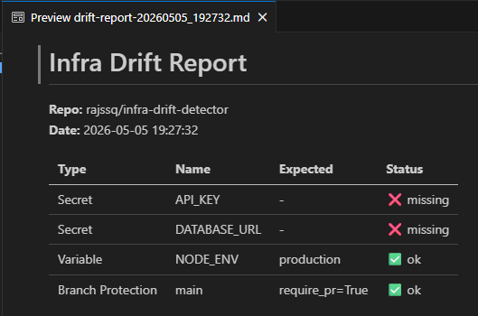

## Demo

> Terminal output after running the detector:



# 🔍 Infra Drift Detector


A CLI tool that compares your repository's actual state against a declarative config — and reports what's missing or misconfigured.

Inspired by the same concept behind Terraform and ArgoCD: **declare what you expect, detect what drifted**.

## Why this exists

Teams waste time discovering manually that a secret disappeared or a branch protection rule was removed. This tool makes the expected infra state explicit and auditable.

## How it works

1. You declare the expected state in `config/expected.yml`
2. The detector queries the GitHub API and compares
3. A drift report is printed to the terminal and saved to `reports/`

## Usage

```bash
python src/detector.py <github_token>
```

## Config example

```yaml
repository: your-user/your-repo

expected:
  secrets:
    - name: API_KEY
  variables:
    - name: NODE_ENV
      value: production
  branch_protection:
    - branch: main
      require_pr: true
```

## Automation

Runs automatically every Monday at 9am via GitHub Actions, or manually via `workflow_dispatch`.

## Stack

Python · GitHub API · Rich · PyYAML · GitHub Actions
